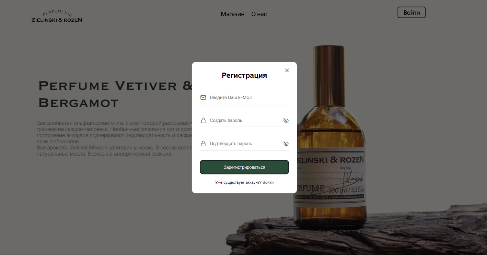
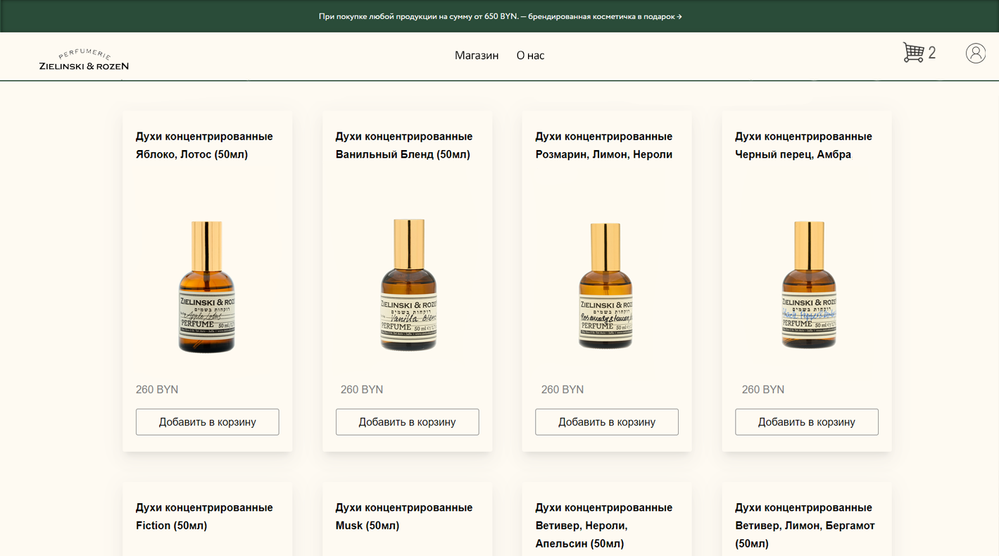
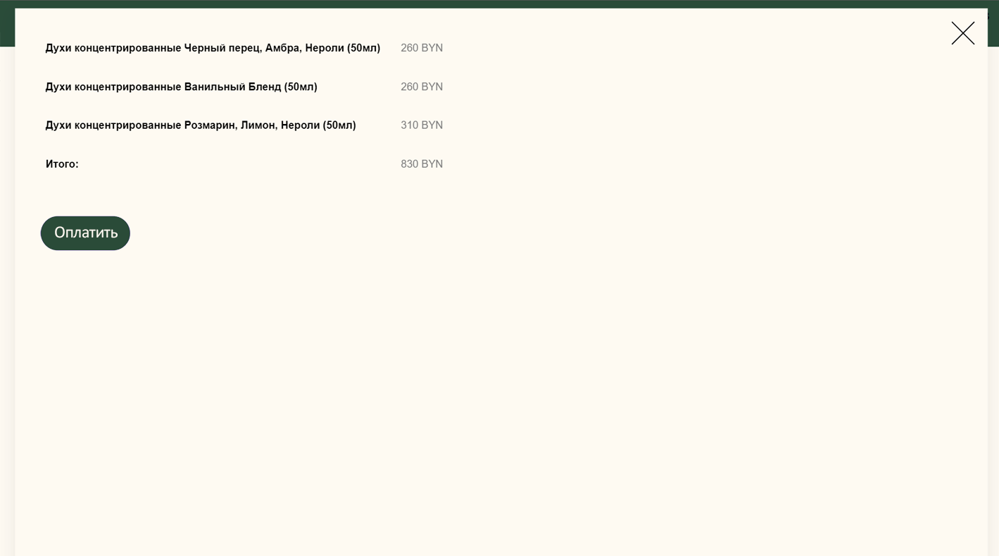

# ITandDDP_labs

Данный проект включает в себя реплику магазина Zielinski & Rozen.

---

**Главная страница**

**Окно регистрации и авторизации**

**Страница продуктов**

**Корзина**

**Функции, используемые в проекте:**

- Функция отображения каталога товаров
- Функция добавления в корзину
- Функция отображения корзины
- Функция изменения числа товаров в корзине
- Функция подсчета суммы товаров в корзине 
- Сохранение в Local Storage 
---

**Модели данных:**

- Модель товара:
  - Название товара
  - Фотография товара
  - Цена товара
  
- Модель корзины
  - Список товаров 
---
